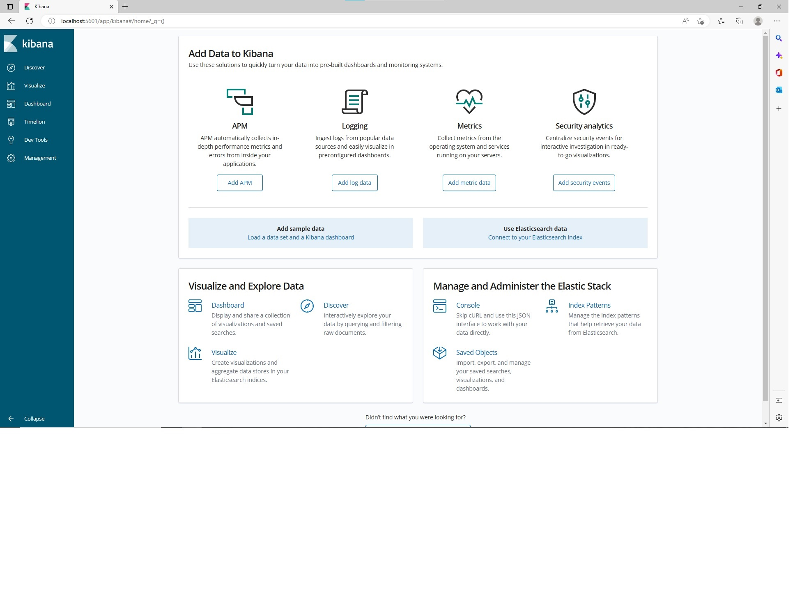
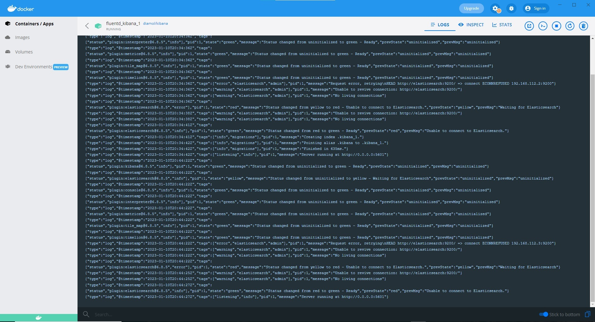

# Instrukcja
Uruchamianie - w folderze fluentd
```sh
docker-compose up
```
Po uruchomieniu fluentd w folderze numbers
```sh
docker-compose up
``` 
# Screenshot
#### Kibana - w przeglądarce

#### Kibana - w Docker Desktop
